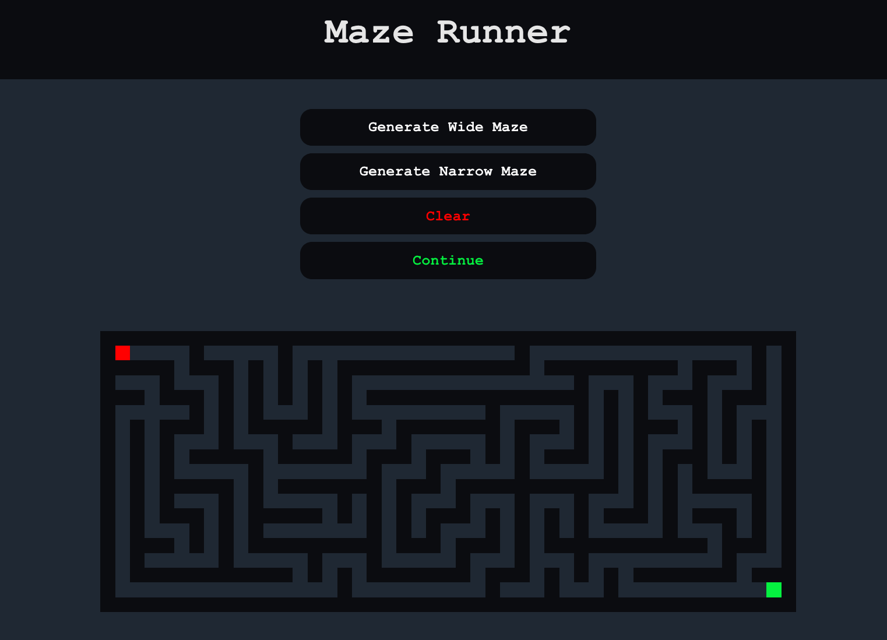
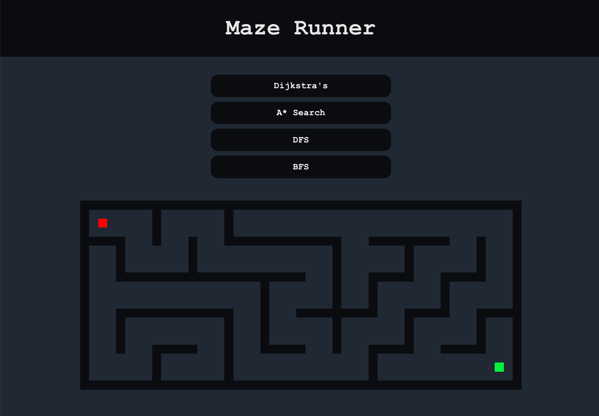

This project was bootstrapped with [Create React App](https://github.com/facebook/create-react-app).

## Maze Runner

Open [francismacapobre.github.io/algorithm-visualizer/](https://francismacapobre.github.io/algorithm-visualizer/) to view it in the browser.

---

### Maze Generation Algorithm

Both **Wide Maze** and **Narrow Maze** are implemented with ***randomized depth-first search*** algorithm. A user may click **Generate Wide Maze**, **Generate Narrow Maze**, or click anywhere within the maze boundaries to create a custom wall pattern. Once a user finds a suitable maze, they may then click **Continue** to select a pathfinding algorithm.

---

### Uninformed & Informed Search Algorithm

**BFS**, **DFS**, and **A\* Search** are all implementations of the **Generic search algorithm**.

This application includes three uninformed search algorithms: ***Breadth-first search (BFS)***, ***Depth-first search (DFS)***, and ***Dijkstra's algorithm***.  

This application includes one informed search algorithm: ***A\* Search***, which uses **Manhattan Distance** as it's admissible heuristic.

*b is the maximum forward branching factor, m is the maximum path length
|                 | ***Complete*** | ***Optimal*** |      ***Time***    |        ***Space*** |
| -------------   |     ----------:|         -----:|              -----:|              -----:|
| **DFS**         | False          |         False | O(bm)   |   O(mb)            |
| **BFS**         | True           |        True   | O(bm)   |  O(bm)  |
| **Dijkstra's**  | True           |        True   |    O(bm)|  O(bm)  |
| **A\***         | True           |        True   |  O(bm)  | O(bm)   |

---

Below is a screenshot image of ***Dijkstra's algorithm*** running. All animations were implemented with ***CSS***.

